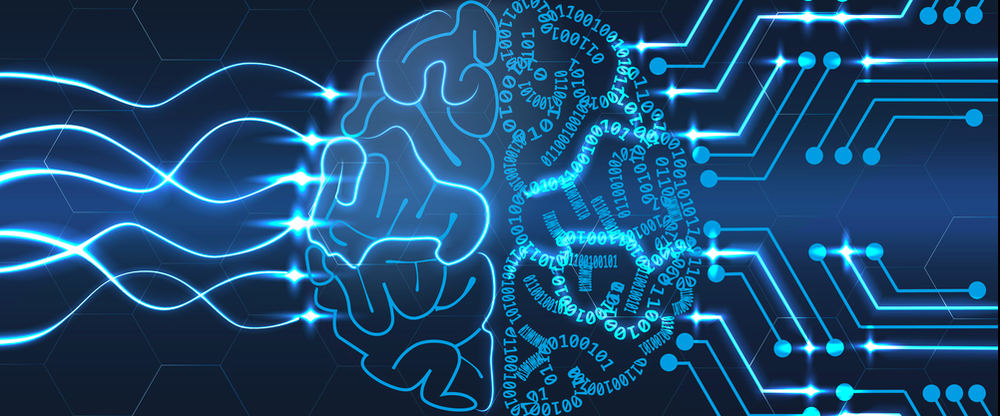
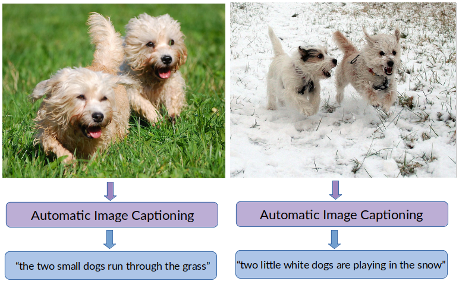

# Automatic Image Captioning with Deep Learning
By Gaurav Gill,
   Aditi Mishra,
   Anshika Verma,
   Sanidhya Kumar,
   Aditya Deshmukh

<!--  -->

## Introduction
Google released the ‘Google’s Conceptual Captions’ dataset for image captioning as a new image-recognition challenge and an exercise in AI-driven education. Since pictures may convey a great deal of information, it is important that we create ways of generating conceptual captions from images automatically and accurately.

This project focus on combining current state-of-the-art techniques in both computer vision and natural language processing in a single jointly-trained system which takes images as inputs and generates human-readable descriptions of them.

## Objective
Develop a useful Deep Learning application which combines both computer vision and natural language processing to create accurate, comprehensible captions from images alone.

Understand the various ways in which we can train Neural Networks more quickly through the use of optimizers?

Understand what’s going on in the model, detailing the inter-relations between components.

Figure 1. Flowchart for automatic image captioning

